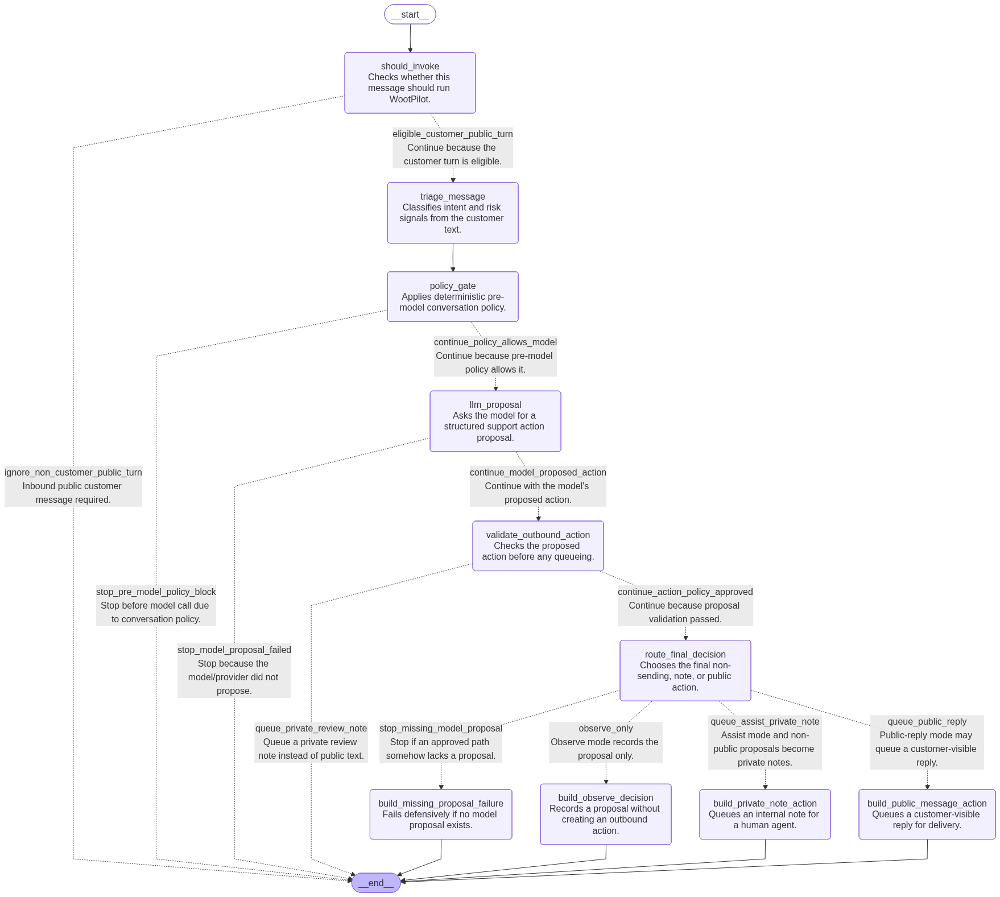

# Policy And Agent Workflow

## Bot Modes

WootPilot should support three operating modes.

### Shadow

The agent evaluates the conversation but does not write to Chatwoot.

Use this mode for early production testing.

### Copilot

The agent writes private notes in Chatwoot with suggested replies, concise
reasoning summaries, relevant context, and risk reasons.

Use this mode when humans should remain fully in control of customer-facing
messages.

Copilot private notes are the default write mode for the MVP.

Copilot mode does not use LangGraph interrupts in the MVP. The graph produces a
proposal, WootPilot queues or writes the private note, and the run completes.
Human review happens in Chatwoot.

If a human replies publicly, WootPilot treats the conversation as human-active
and suppresses public replies for the configured window. The default window
is 15 minutes.

### Limited Auto

The agent may send public messages only when deterministic policy says the case
is low risk.

Limited auto mode must require explicit configuration. Do not make public sends
the default behavior for a new tenant or local development setup.

Examples:

- Answering simple FAQ questions from approved context.
- Sending a public product or documentation link.
- Asking for missing information.
- Confirming that a human will review the request.

## Deterministic Policy

Policy should run before and after the LLM.

Pre-model policy decides whether a message is eligible for AI handling.

Post-model policy validates any proposed outbound action.

Initial policy rules:

- Ignore private notes.
- Ignore outbound messages.
- Ignore bot or AI echoes.
- Ignore system events.
- Do not reply when Chatwoot or channel policy says replies are closed.
- Do not send public handoff confirmations when a human agent is already active.
- Do not make claims about refunds, discounts, guarantees, legal policy,
  technical compatibility, delivery time, or account changes without approval.
- Do not expose private reasoning or internal triage in public messages.
- Do not send if the target conversation id does not match the current event.
- Hand off to a human when the customer explicitly asks for a person, manager,
  callback, cancellation, refund, discount, account change, or sensitive policy
  decision.
- Do not resume public replies while a WootPilot pause label/custom attribute
  is present.

## Ingress Before LangGraph

Inbound webhook handling should finish before LangGraph starts. The ingress
pipeline should:

- Authenticate the webhook through Chatwoot's signed webhook headers:
  `X-Chatwoot-Signature` and `X-Chatwoot-Timestamp`, verified with the
  Chatwoot-generated webhook secret.
- Reject stale or replayed requests using provider event ids, timestamps, and a
  short replay window.
- Persist the raw event before channel translation.
- Deduplicate provider events with database uniqueness constraints.
- Normalize Chatwoot payloads into internal message models.
- Mark ignored events without invoking the LLM.

LangGraph should receive a trusted normalized message, prepared conversation
state, prepared catalog context, bot mode, and policy inputs. It should not know
how to verify signatures, parse raw webhook envelopes, discover connectors, or
perform external writes.

## Application Use Cases

Keep the workflow centered on a few application use cases:

```text
HandleWebhookEvent
RunSupportWorkflow
BuildCatalogContext
ExecuteOutboundAction
```

The graph should orchestrate decision state from prepared inputs. Durable state
transitions such as raw-event dedupe, connector context loading, context snapshot
persistence, audit persistence, and outbound action execution should be owned by
application use cases so they can be tested without replaying the whole graph.

The MVP handoff contract is documented in
[MVP Conversation Behavior](../product/conversation-behavior.md). In short: WootPilot
hands off by not sending public AI messages, writing private notes or labels when
useful, and observing human replies or explicit pause/resume signals from
Chatwoot before deciding whether a later customer turn is eligible for AI again.

## LangGraph Workflow

The first graph should be explicit and boring in the best way.

Implement it as a typed LangGraph `StateGraph`. Prefer `TypedDict` graph state
with Pydantic v2 domain models at the application boundaries. Nodes should
return partial state updates and leave database writes, connector reads, and
Chatwoot writes to application services.

State:

```text
normalized_message
conversation_context
human_operator_state
triage_result
catalog_context
automation_mode
pre_model_policy_decision
agent_proposal
outbound_action_candidate
workflow_decision
```

Agent nodes:

```text
should_invoke
triage_message
policy_gate
llm_proposal
validate_outbound_action
route_final_decision
build_observe_decision
build_private_note_action
build_public_message_action
build_missing_proposal_failure
```

Current rendered topology:



The Mermaid source is versioned at
[support-workflow-graph.mmd](../reference/support-workflow-graph.mmd). Regenerate both files
after graph routing changes:

```bash
uv run python scripts/render-support-workflow-graph.py
```

Use conditional edges for simple branches. Use LangGraph `Command` only when a
node needs to update state and route together, such as sending an exhausted
provider failure to a blocked workflow decision. Add node-level retry policy to
transient external reads such as `llm_proposal`; do not retry deterministic
policy or validation failures.

`RunSupportWorkflow` should load human operator state, build catalog context,
persist the context snapshots used by the run, invoke the graph, persist the
audit record, and queue an outbound action after the graph returns a decision.
The graph should finish each MVP workflow run without waiting for human approval
or resume input.

Outbound execution should be a separate application use case or worker, not an
LLM node. That use case should load the queued action, re-check policy, re-read
human operator and replyability state through the channel safety port, send
through the channel writer, and update the action status idempotently.

Branching:

```text
ignored event -> audit decision -> done
observe mode -> llm proposal -> audit decision -> done
assist mode -> private note candidate -> guard -> queue note action
public reply safe -> public message candidate -> guard -> queue public action
risky or uncertain -> private note -> guard -> queue note action
human active or paused -> optional private note -> done
```

Before a public send, the outbound executor must re-check the conversation id,
conversation replyability, bot mode, human-active state, and the exact content
being sent. A case that was safe at proposal time can become unsafe while waiting
in the queue.

Snapshot fields such as `price.canMention` and `availability.canMention` are
inputs to policy, not final authorization. The final policy decision must inspect
the exact public content and current tenant/channel state before execution.

## Structured Outputs

Every model call that affects workflow state should return Pydantic-validated
structured output. The model returns proposals only. System execution status is
computed after deterministic checks and channel API results.

OpenRouter is the MVP model provider. Model adapter code should sit behind
`ModelProposalPort` so prompts, structured output handling, retries, usage
capture, and provider errors stay outside domain services and graph state.

Prefer the current LangChain structured-output APIs rather than parsing JSON
from free-form text. For model-level calls, use
`ChatOpenRouter.with_structured_output(...)`; for an adapter that benefits from
LangChain's agent wrapper, use `create_agent(..., response_format=...)` with an
explicit Pydantic schema or strategy. Choose provider-native JSON Schema output
when the selected OpenRouter model supports it well, otherwise fall back to
tool/function-calling structured output. Always validate into a WootPilot-owned
schema before creating a domain `AgentProposal`.

Initial proposal and status schema:

```python
from enum import StrEnum
from pydantic import BaseModel, ConfigDict, Field


class AutomationMode(StrEnum):
    observe = "observe"
    assist = "assist"
    public_reply = "public_reply"


class AgentRunStatus(StrEnum):
    ignored = "ignored"
    proposed = "proposed"
    blocked_by_policy = "blocked_by_policy"
    queued_action = "queued_action"
    sent_public_message = "sent_public_message"
    sent_private_note = "sent_private_note"
    failed = "failed"


class AgentActionKind(StrEnum):
    none = "none"
    public_message = "public_message"
    private_note = "private_note"


class AgentProposal(BaseModel):
    """LLM-produced action proposal; never a final execution result."""

    model_config = ConfigDict(strict=True)

    action_kind: AgentActionKind
    summary: str
    public_message: str | None = None
    private_note: str | None = None
    risk_reasons: list[str] = Field(default_factory=list)
    context_snapshot_ids: list[str] = Field(default_factory=list)
    confidence: float = Field(ge=0.0, le=1.0)
    error_code: str | None = None
```

`AgentRunStatus.sent_public_message`, `sent_private_note`, and `failed` are
assigned by WootPilot after action execution. The LLM must not claim that an
action was sent.
